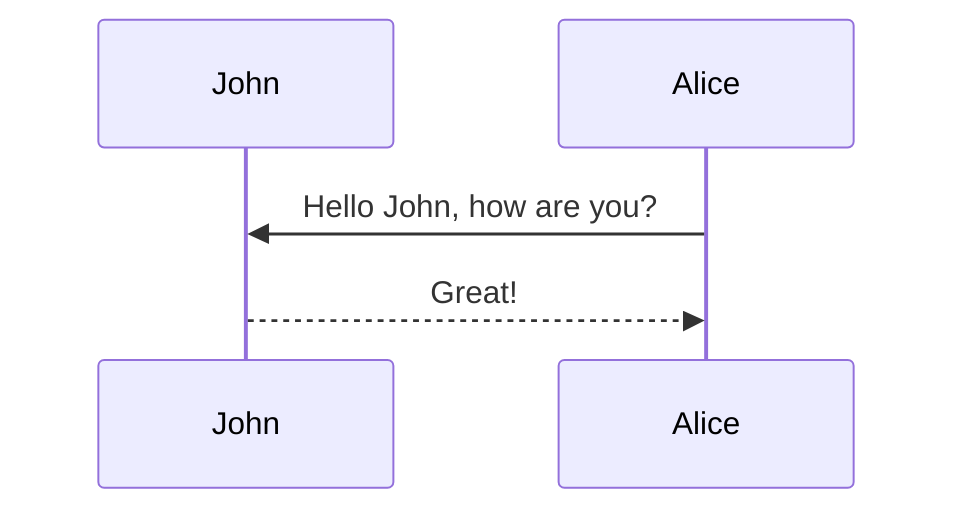

This theme supports generating various diagrams from a text description using [mermaid](https://mermaid-js.github.io/mermaid/){:target="\_blank"}. Previously, this was done using the [jekyll-diagrams](https://github.com/zhustec/jekyll-diagrams){:target="\_blank"} plugin. For more information on this matter, see the [related issue](https://github.com/alshedivat/al-folio/issues/1609#issuecomment-1656995674). To disable the zooming feature, set `mermaid.zoomable` to `false` in this post frontmatter.

How to synthesize graphs that are high-fidelity representations of real social networks has been a question for quite some time. There are a few very popoular - even classic, at this point - approaches, notably the Erdos-Renyi, Barábasi-Albert or Watts-Strogatz models. The literature on any of these three is so large and rich that there's no possible way I could provide a better explanation or intuition of their mechanics than anything already out there. However, it is worth mentioning why none of these are perfect models, and why RHGs can outperform them in quality in some aspects.


## Mermaid

The diagram below was generated by the following code:

````markdown

````


