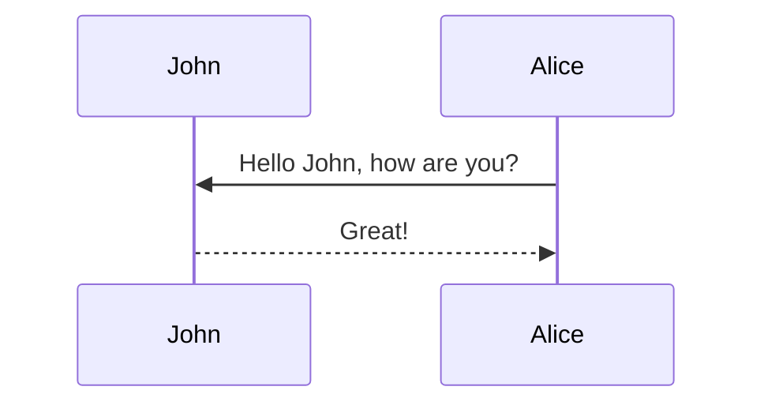

This theme supports generating various diagrams from a text description using [mermaid](https://mermaid-js.github.io/mermaid/){:target="\_blank"}. Previously, this was done using the [jekyll-diagrams](https://github.com/zhustec/jekyll-diagrams){:target="\_blank"} plugin. For more information on this matter, see the [related issue](https://github.com/alshedivat/al-folio/issues/1609#issuecomment-1656995674). To disable the zooming feature, set `mermaid.zoomable` to `false` in this post frontmatter.

The gossiping problem was proposed originally as follows \cite{baker1972gossips}:

    There are $n$ ladies, and each of them knows some item of gossip not known to the others. They communicate by telephone, and whenever one lady calls another, they tell each other all that they know at that time. How many calls are required before each gossip knows everything?
    
If we set the number of gossips to 1, this is equivalent to broadcasting. Now, intuitively, celebrities or __influencers__ should be the most effective sources of gossip to optimize the spread speed, right? But if we are trying to promote our friend's business, getting a "big" celebrity to talk about it might be unfeasible. Rather, we could think of contacting a few, less-known micro-celebrities. Maybe if we do that skillfully enough, we might be even able to spread our message even faster than if we contacted the big celebrity to begin with!

We want to focus on this new optimization problem. How many, how popular celebrities would be optimal for our gossiping or broadcasting scenario?

We will define the cost of getting someone to spread our gossip as their degree.


## Mermaid

The diagram below was generated by the following code:

````markdown

````


